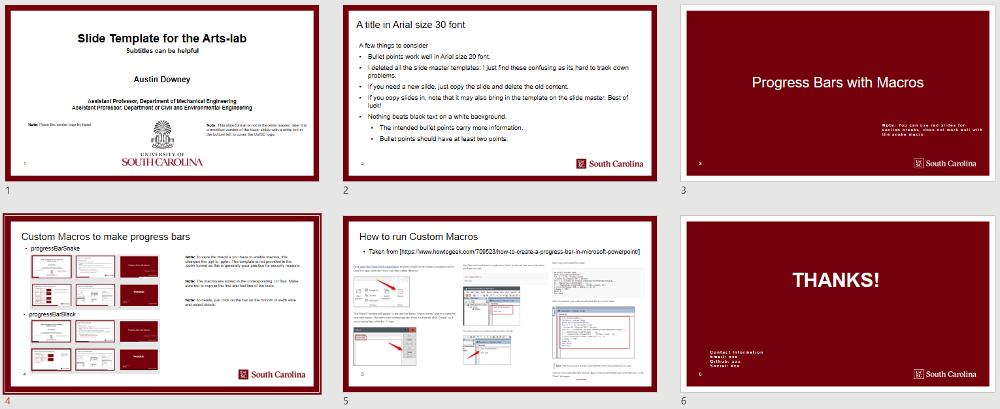

# PowerPoint-Template
A modified Powerpoint template to use for internal meetings.

1. The PPT is based on the UofSC slide deck, but with fonts that play nice with open-source fonts. 
1. Greatly reduced the number of layout in the slide master.
1. Added page numbers.
1. Macros are provided for progress bars on the bottom of the slides, you can run a macro though view > . They are:
	- progressBarSnake - completes the red box around the outside of slides as the presentation progresses 
	- progressBarBlack - Draws a black bar across the bottom of the slides, but inside the boarder as the presentation progresses 

