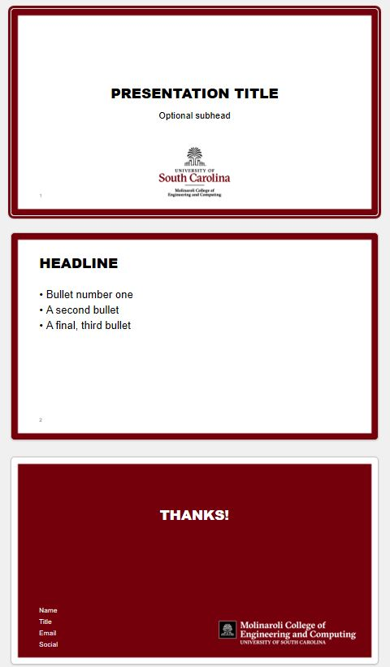

# PowerPoint-Template
A modified USC Powerpoint template.

1. The PPT is based on the USC slide deck, but with fonts that play nice with open-source fonts. 
1. Greatly reduced the number of layout in the slide master.
1. Added page numbers.

