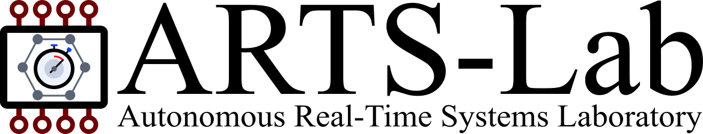

# ARTS-Lab Resources
General resources for the Autonomous Real-Time Systems Laboratory (ARTS-Lab); an intelligent controls group at the University of South Carolina.

A current version of the ARTS-Lab handbook can be found [here](https://www.dropbox.com/scl/fi/mem5yz9diqc0gbztw6ui0/arts_lab_graduate_handbook.pdf?rlkey=62yae8kwhcqnc9mxl6dg0l0de&dl=0)

## [Ph.D. Proposal Template](Template_Ph.D._Proposal)
Template and supporting files for preparing an ARTS-Lab Ph.D. proposal.

## [Thesis and Dissertation Template](Template_Thesis_Dissertation)
Template and supporting files for preparing master's theses and Ph.D. dissertations.

## [PowerPoint Template](Template_PowerPoint)
ARTS-Lab PowerPoint template based on USC branding for presentations and research talks.

## [Poster Template](Template_Poster)
PowerPoint-based poster template for preparing ARTS-Lab research posters.

## [Word Template](Template_Word)
Basic Word document template using ARTS-Lab and USC formatting and colors.

## [Logos](Logos)
ARTS-Lab logos and other branding assets for use in presentations, documents, posters, and other materials.

## [Stickers](stickers)
Design files and resources for ARTS-Lab stickers.

## [Lab Art](Lab_Art)
ARTS-Lab artwork, graphics, and other visual assets.

